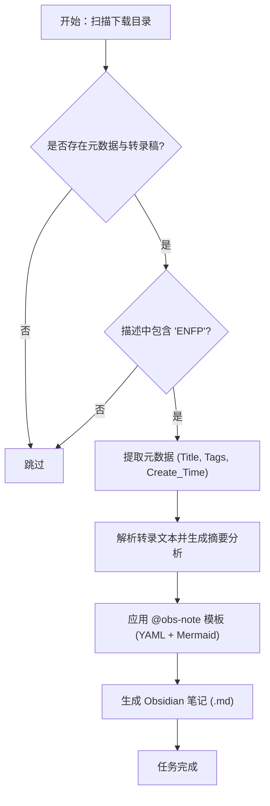

# 开发日志：ENFP 视频笔记批量生成任务复盘

## 1. 任务概述 (Overview)
本次任务旨在对 `douyin-downloader` 下载的视频数据进行系统化整理。通过解析视频元数据 (`*_result.json`) 和语音转路稿 (`transcript.json`)，筛选出与 "ENFP" 相关的内容，并按照 `@[obs-note]` 规范生成结构化的 Obsidian 笔记，以便于在 `RPG` 库中进行知识管理。

## 2. 核心流程 (Core Process)

## 3. 执行细节 (Implementation Details)

### 3.1 统计数据
- **总扫描目录数**: 33 个
- **匹配 "ENFP" 视频数**: 22 个
- **成功生成笔记数**: 21 个
- **异常跳过数**: 1 个 (原因：`transcript.json` 内容为无效占位符)

### 3.2 关键实现技术
- **环境要求**: 使用 `uv` 管理 Python 环境，配置清华大学镜像源以保证依赖下载速度。
- **匹配逻辑**: 对 `desc` 字段进行不区分大小写的关键词匹配，并结合正则表达式提取话题标签。
- **笔记增强**: 
    - 引入 **Mermaid 流程图** 可视化性格动力学和冲突逻辑。
    - 自动生成 **丰富 Alias** 分类（如“快乐小狗”、“彩虹组”等）增强搜索权重。
    - 采用 **Obsidian Callouts** (Alerts) 突出展示核心警告或提示。

## 4. 交付成果 (Deliverables)
- **目标路径**: `/Users/tsinglungtseng/obsidian/RPG/`
- **主要笔记示例**:
    - `绿人组共情能力大比拼：同理心 vs 同情心.md`
    - `INTJ 为什么容易喜欢 ENFP？：灰暗世界的彩虹解药.md`
    - `MBTI '犯贱' 大王：背后的心理博弈.md`
    - `MBTI 之计划性：J 人与 P 人的博弈.md`

## 5. 回顾与优化 (Looking Back)
- **改进点**: 初始脚本仅做了简单的描述叠加，后改为基于内容深度解析的多维度笔记结构（含核心视角、机理分析、逻辑映射），显著提升了笔记的二次阅读价值。
- **稳定性**: 增加了对损坏 JSON 或空转录稿的健壮性处理。

---
**日期**: 2026-01-06
**负责人**: Antigravity
